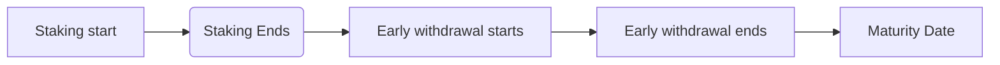
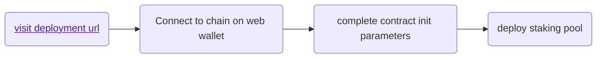

# Ferrum Network Staking Casper Network Frontend

## Steps to Run Locally

- clone repository `https://github.com/ferrumnet/staking-casper-frontend.git`.

Hardware Requirements:
- node version 15>
- yarn

**To run Staking contract deployer directory (admin):**

From terminal :-

- run npm install

- run npm start

- from browser open url http://localhost:3000/admin


**NB: token and reward token params in above url can changed to desired staking token address as required**

- connect casper client to site.

- Enter all required details to deploy a new staking contract.

- click on deploy and approve wallet transaction.

- after successful execution of transaction, deployment address is displayed on an alert box on admin dashboard.


**To Add rewards to a staking pool**

- Rewards can be added via Cli command

```bash
casper-client put-deploy \
    --chain-name casper-test \
    --node-address http://44.208.234.65:7777 \
    --secret-key ./staking_contract/keys/secret_key.pem \
    --session-hash hash-5eba0235bbd34613c19163a65ee16ea6c4019fbf5f5e7c8e07fbebd52d92eef4 \
    --session-entry-point add_reward \
    --payment-amount 50000000000 \
    --session-arg "reward_amount:u256='1'" \
    --session-arg "withdrawable_amount:u256='1'"
```

- The parameters required for this are detailed in the command above where the session hash refers to the deployed staking contract hash reward is being added to.

### Frontend :

From terminal: -

- Run `yarn/npm install`

- Run `yarn/npm start`

- from browser, naviagte to `localhost:{port}/{staking_contract_deploy_hash}` (where port is the port opened by above command).

- At this point, users are able to interact with the contract based on the current cycle the contract is.

<br />
 
# Architecture details

The Ferrum staking as a service is an open source implementation of ferrum’s blockchain token staking technology. 

Contract:

To deploy a contract , users can use the deploy UI as detailed in the frontend section below or using hardhat.

To deploy contract, run the following commands from shell

```
casper-client put-deploy \
  --chain-name casper-test \
  --node-address http://44.208.234.65:7777 \
  --secret-key ./staking_contract/keys/secret_key.pem \
  --session-path ./staking_contract/target/wasm32-unknown-unknown/release/staking_contract.wasm \
  --payment-amount 200000000000 \
  --session-arg "name:string='FerrumX'" \
  --session-arg "address:string='782fe4b0bb944e6b1fd2c5a1456a78f0e2193d47dee9b1af5711d6b6e6aaca60'" \
  --session-arg "staking_starts:u64='0'" \
  --session-arg "staking_ends:u64='1783095016794'" \
  --session-arg "withdraw_starts:u64='0'" \
  --session-arg "withdraw_ends:u64='1755994649'" \
  --session-arg "staking_total:U256='500000'" \
  --session-arg "erc20_contract_package_hash:Key='hash-e222974816f70ca96fc4002a696bb552e2959d3463158cd82a7bfc8a94c03473'"
 ``` 

The staking contract will be deployed and deploy hash displayed on successful in terminal.

<br />

**The ferrum staking contract/pools allows the following periods during the pool cycle:**



Frontend: The process of deploying a staking client is divided into three steps -
- Deploy an upgradable token contract to be staked (if necessary).
- Deployment of staking contracts.
- Deployment of staking UI.

**Deploying a staking contract :**
To deploy a staking contract , an intuitive UI has been created to handle the deployment of the staking contract. This simplifies the deployment of the staking contract by enabling the use of a frontend client chich requires passing in the required parameters needed to deploy the various staking smart contracts offered by ferrum. The types of staking contract/pools available to be deployed includes
- Traditional staking contract
 
The staking contract deployment form requires the following parameters which are required for the intialisation of the staking contract ot be deployed. 

The parameters required for deployment of the staking contract includes :
  
*Token* : This is a valid token address on the selected network and the base token which will be staked on the contract.
 
*Staking Cap* : This is the maximum amount of tokens which can be staked on the staking contract/pool to be deployed. As denoted by the label, this is the cap on top of the staking
 
*Staking Start* : This is the exact date which staking would start for this contract/pool. It is the date which users would be able to stake the required token. Staking will be activated at the exact date specified and the time specified in the events time sequence field during contract initialisation.
 
*Staking End* : This is the date at which staking would end and users/stakers would not be able to send/stake the contract token at the exact date specified in this field and at the exact time specified in the eventsTime field during contract initialisation.
 
*Withdraw Start/Early withdrawal start date* : This is the date which users would be able to start withdrawing the rewards accrued so far during the duration of the staking contract. At this point, users/stakers who withdraw would not have the full possible APR available to that pool but it would be the APR which has been accrued so far at that point in time for that pool.
 
*Withdraw End* :  This is the date at which early withdrawal would end and users would not be able to withdraw until the maturity date for the pool as elapsed. At the date specified for this field , users would not be able to carry out early withdrawals anymore and would have to wait till the pool closes on the maturity date.
 
*Maturity date* : This is the date which users would be able to withdraw all their staked tokens and the full APR value possibly accrued over the duration of the staking period. The maturity date must be configured to occur after the date early withdrawal ends and the date staking ends.

After passing in the required paramters at the deployment url, clicking on the deploy action button triggers the connected browser wallet for approval of contract deployment on the connected chain. The contract is deployed on chain and on succcesful chain execution of contract deployment.



**Staking UI deployment**

 The skating UI is composed of two major parts. The admin section of the staking ui is saddled with deployemtn of staking contracts. This means that once a staking contract is deployed on network as an example, the UI is configured to prsonalise the experience during staking for the user based on the configuration set up for the contract on the selected network. At the end of configuration, the url for staking would be : 


To Run Frontend Admin UI Locally :

#### 1. Fork `https://github.com/ferrumnet/staking-casper-frontend.git` repository
<br />

#### 2. Clone your fork

The project uses create-react-app and requires :

#### -  ``` Node.js```

#### -  ``` Npm/Yarn```

<br />

#### 3. Install dependencies

```shell
yarn install
```
<br />

#### 5. To Run Locally

```shell
yarn start
```

<br />

#### 5. To Build

```shell
yarn build
```

<br />

#### 6. To Test

```shell
yarn test
```

<br />

# To contribute to the project

If you want to contribute to the project and make it better, your help is very welcome!. 

Contributing is useful for bug reports, feature requests and the noblest of all contributions: a good, clean pull request :).

How to contribute :

- Create a personal fork of the project on Github.
- Clone the fork on your local machine. Your remote repo on Github is called origin.
- Add the original repository as a remote called upstream.
- Be sure to pull the latest upstream changes into your local repository.
- Create a new branch to work on! Branch from develop/main.
- Implement/fix your feature, comment your code.
- From your fork open a pull request in the correct branch. Target the project's develop branch 